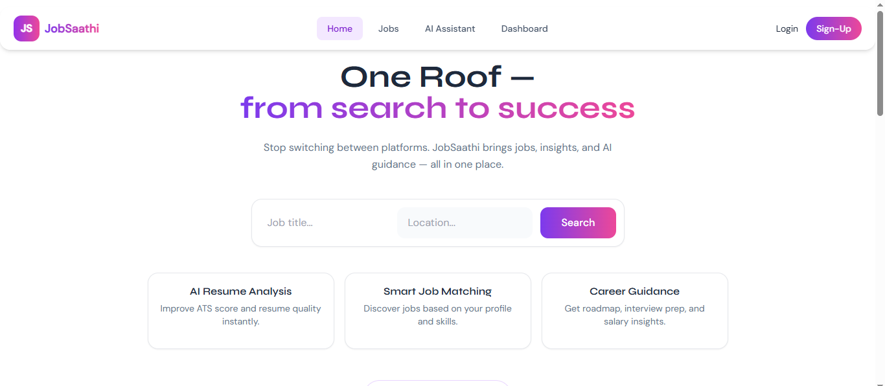
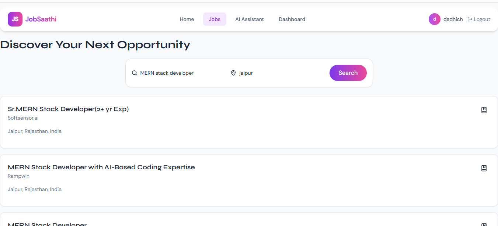
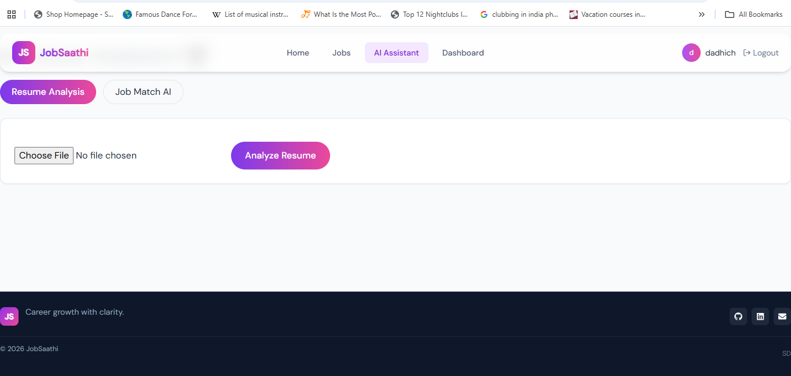
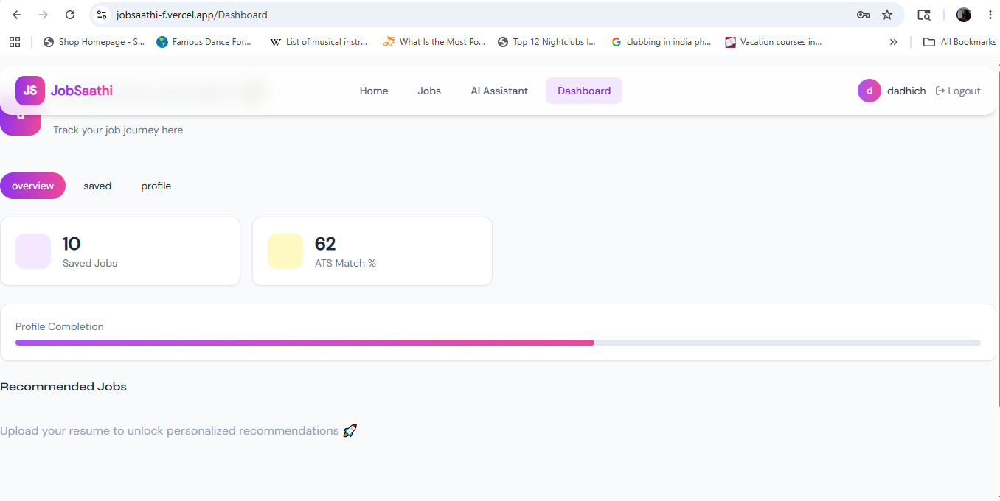

JobSaathi 🚀

JobSaathi is an AI-powered career and job assistance platform designed to simplify the job search journey for students, freshers, and professionals. The platform helps users discover relevant job opportunities, analyze resumes, and receive personalized career guidance through features like Resume Analysis, Job Match AI, Interview Preparation, Career Roadmap Suggestions, and Salary Insights. Users can search jobs based on skills and interests while getting AI-driven recommendations and career support.

JobSaathi aims to bridge the gap between candidates and opportunities by combining modern web technologies with intelligent assistance.

The application is built using the MERN stack with React.js, Node.js, Express.js, MongoDB, JWT Authentication, REST APIs, Tailwind CSS, and AI integrations to provide a scalable and user-friendly experience.


# Frontend Link 
https://jobsaathi-f.vercel.app/

# Backend Link
https://jobsaathi-nfjr.onrender.com

# User Features
User Registration & Login,
Secure JWT Authentication,
Search Jobs by Title & Location,
Apply for Jobs,
View Applied Jobs,
Responsive UI,
AI Chat Assistance,
User Dashboard

# Future User Features
Search Jobs by Keyword,
Real-time Feedback & Notification

# Future Recruiter Features
Recruiter Authentication,
Post New Jobs,
Update/Delete Job Posts,
Manage Candidates,
Recruiter Dashboard,
Track Applications,

# General Features
REST API Architecture,
Protected Routes,
Role-Based Access Control,
MongoDB Database Integration,
Error Handling,
API Integration using Axios,
Modern UI Design,
Deployment Ready


🛠️ Tech Stack

# Frontend
React.js, Vite, Tailwind CSS, Axios, React Router DOM
# Backend
Node.js, Express.js, MongoDB, Mongoose, JWT Authentication, bcrypt.js, dotenv, CORS
# Deployment
Vercel(Frontend), Render(Backend), MongoDB Atlas

📜  folders

# Project Strucutre
JS/
|
|-- backend/
|  |-- middleware/
|  |-- models/       # Backend Application
|  |-- routes/
|  |-- utils/
|  |-- server.js
|
|-- src/
|   |-- assets/
|   |-- components/ 
|   |-- lib/        # Frontend Application
|   |-- pages/ 
|   |-- ui/
|   
|-- app.jsx
|-- config.js
|-- package.json
|-- README.md


## Screeshots






# Installation
```bash
git clone -> https://github.com/dadhichshweta99-pixel/JobSaathi.git
cd js
npm install
npm run dev
```

# Environment Variables

# Run Locally
FRONTEND_URL=http://localhost:1573
BACKEND_URL=http://localhost:5000


## 👩‍💻 Author

**Shweta Dadhich**
MERN Stack Developer

-GitHub: https://github.com/dadhichshweta99-pixel

-LinkedIn: https://www.linkedin.com/in/shweta-dadhich-7670b1192?utm_source=share_via?utm_content=profile&utm_medium=member_android

